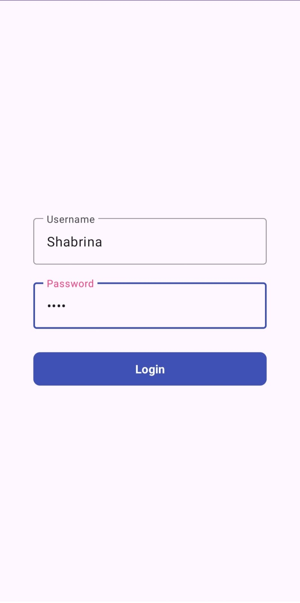
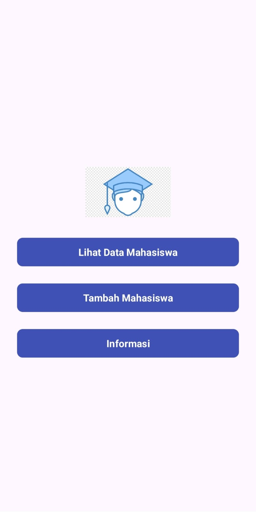
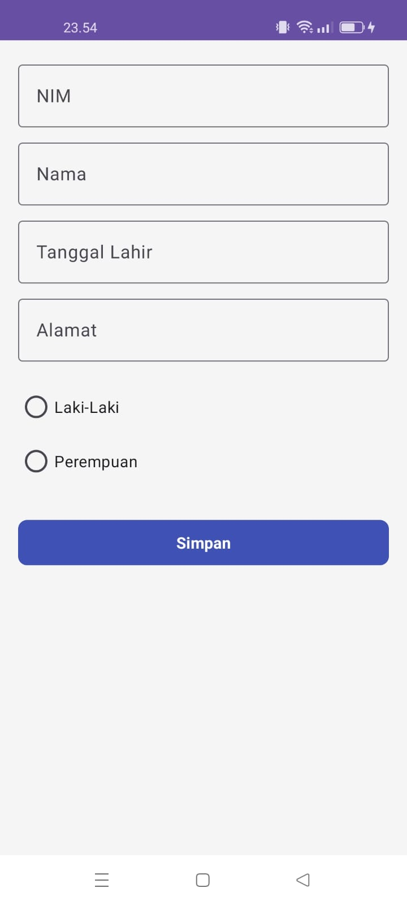
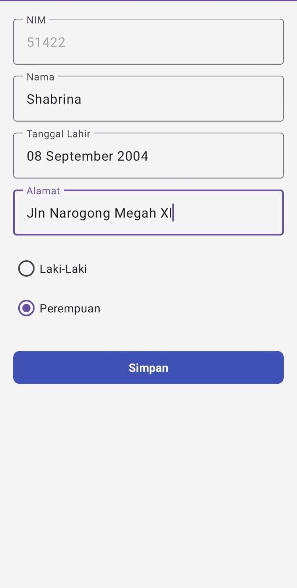
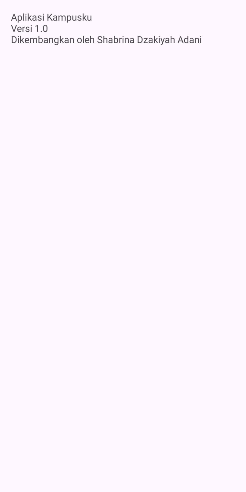

# KampuskuApp

Aplikasi Android untuk manajemen data mahasiswa dengan fitur CRUD (Create, Read, Update, Delete).

## 📱 Fitur

- **Splash Screen**  
  Halaman awal yang muncul saat aplikasi dibuka.  
  

- **Halaman Login**  
  Autentikasi pengguna sebelum masuk ke aplikasi.  
  

- **Dashboard**  
  Tampilan utama setelah login, berisi navigasi ke fitur utama.  
  

- **Mode Tambah Data**  
  Menambahkan data mahasiswa.  
  

- **Mode Edit Data**  
  Mengedit data mahasiswa yang sudah tersimpan.  
  

- **Mode Hapus Data**  
  Menghapus data mahasiswa dari database.  
  

- **Halaman Tentang**  
  Informasi tentang aplikasi dan pengembang.  
  

## 🛠 Teknologi yang Digunakan

- **Android Studio** - IDE utama untuk pengembangan.
- **Kotlin** - Bahasa pemrograman yang digunakan.
- **SQLite** - Database untuk menyimpan data mahasiswa.

---

💡 *Aplikasi ini dikembangkan untuk mempermudah pengelolaan data mahasiswa dengan fitur lengkap dan antarmuka yang user-friendly.* 🚀
